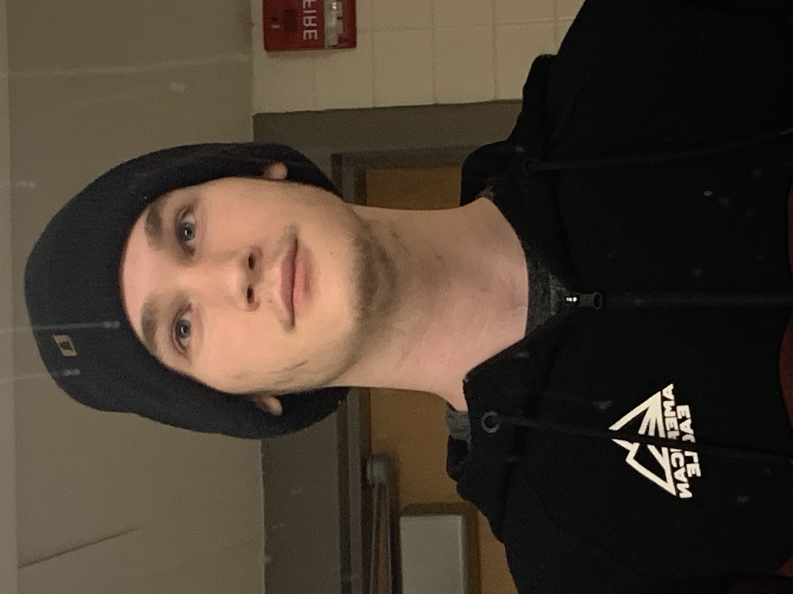

# WebDev-Class

## About Me 
Hello my name is Tyler Wendover. I became interested in computer science later in high school and decided to pursue it in college. So far I have used a good few different programming languages including Java, c/c++, python, HTML, css and very little php. After learning a little HTML and css in CS3 last semester, I found that I really liked web developement and decided to take this class. One interesting project I have worked on was done in a class called Software Engieering. In this project we made a game using the Unreal Engine software. Learning how to use it was a fun change of pace from the normal computer science classes as it was the class that gave me the skills for development and prepared me for what comnes next. 
## My Plans
With what I learn in this class I see myself going on to work in web development. From all of the topics that I have studied, web programming has by far been the one i've been most interested in. In particular I want to go into full stack development, although i'm not very good at design so I cannot make sites that look very good but even still I enjoy that aspect and wish to get better at it. My hopes for this class are to get good enough to pursue a career in full stack development. 
## Me
